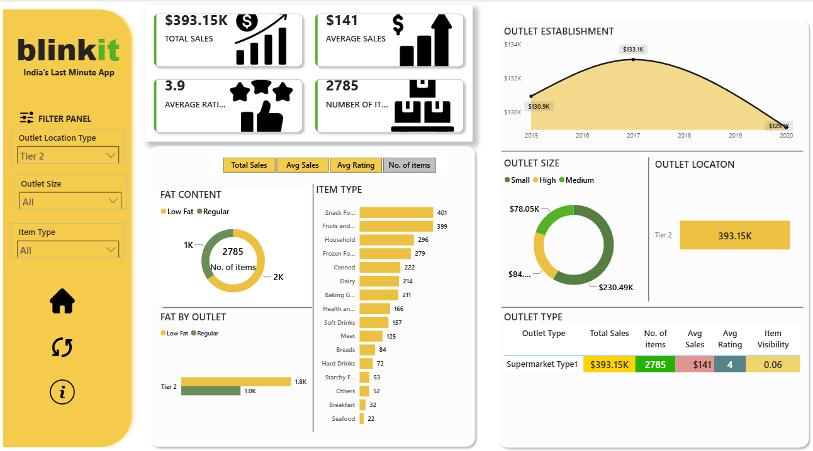

# 🛒 Blinkit Grocery Sales Analysis Dashboard | Power BI

## 📌 Overview

The **Blinkit Grocery Sales Analysis Dashboard** is an interactive Power BI project designed to analyze grocery sales performance across different outlet types, outlet sizes, locations, and product categories.

The dashboard transforms raw sales data into meaningful business insights using **Power Query**, **Data Modeling**, and **DAX**, enabling stakeholders to monitor KPIs and identify sales trends for better decision-making.

---

## 🎯 Project Objectives

- Analyze overall sales performance across Blinkit outlets
- Compare sales by outlet size, type, and location
- Understand product distribution by item type
- Analyze Low Fat vs Regular product sales
- Track outlet establishment trends over time
- Monitor important business KPIs

---

# 📊 Dashboard Preview



---

## 📈 Dashboard KPIs

| KPI | Value |
|------|--------|
| 💰 Total Sales | **$393.15K** |
| 📦 Number of Items | **2,785** |
| ⭐ Average Rating | **3.9** |
| 💵 Average Sales | **$141** |

---

## 📊 Dashboard Insights


### 📈 Sales Performance
- Total sales reached **$393.15K** across all outlets.
- Average sales per item are **$141**.
- The dataset contains **2,785 products**.
- Overall customer rating is **3.9/5**.

### 🏪 Outlet Analysis
- Analyze sales by **Outlet Size** (Small, Medium, High).
- Compare sales across different **Outlet Locations**.
- Evaluate sales performance by **Outlet Type**.
- Track **Outlet Establishment** trends over multiple years.

### 🥫 Product Analysis
- Compare **Low Fat vs Regular** product sales.
- Analyze product distribution across different **Item Types**.
- Identify highest contributing product categories.

### 📌 Interactive Filters
Users can dynamically filter the dashboard by:

- Outlet Location Type
- Outlet Size
- Item Type

---

## 🛠️ Tools & Technologies

- **Power BI Desktop**
- **Power Query**
- **DAX (Data Analysis Expressions)**
- **Microsoft Excel**
- **Data Modeling**

---

## ⚙️ Data Workflow

```text
Excel Dataset
      │
      ▼
Power Query
(Data Cleaning & Transformation)
      │
      ▼
Data Modeling
(Relationships)
      │
      ▼
DAX Measures
(KPIs & Calculations)
      │
      ▼
Interactive Power BI Dashboard
```

---

## 📁 Project Structure

```text
Blinkit-Analysis-Dashboard/
│
├── BlinkIT Grocery Data.xlsx
├── Blinkit-analysis-dashboard.pbix
├── Blinkit.png
└── README.md
```

---

## 📊 DAX Measures Used

- Total Sales
- Average Sales
- Number of Items
- Average Rating

---

## 💡 Key Business Insights

- High-size outlets contribute the largest share of total sales.
- Regular fat products outperform low-fat products in sales.
- Snack Foods and Fruits & Vegetables are among the highest-selling item categories.
- Sales peaked around **2017** before showing a gradual decline.
- Tier-2 outlets generated significant revenue within the dataset.

---

## 🚀 Skills Demonstrated

- Data Cleaning using Power Query
- Data Modeling
- DAX Calculations
- KPI Design
- Interactive Dashboard Development
- Data Visualization
- Business Intelligence
- Dashboard Storytelling

---

## 🔮 Future Improvements

- Real-time data integration
- Customer segmentation analysis
- Profit and margin analysis
- Monthly & yearly sales forecasting
- Drill-through reports
- Dynamic tooltip pages

---

## 👨‍💻 Author

**Preet Solanki**

📧 Open to Data Analyst | Business Analyst | Data Scientist Opportunities

---

## ⭐ Support

If you found this project helpful, consider giving it a ⭐ on GitHub.
